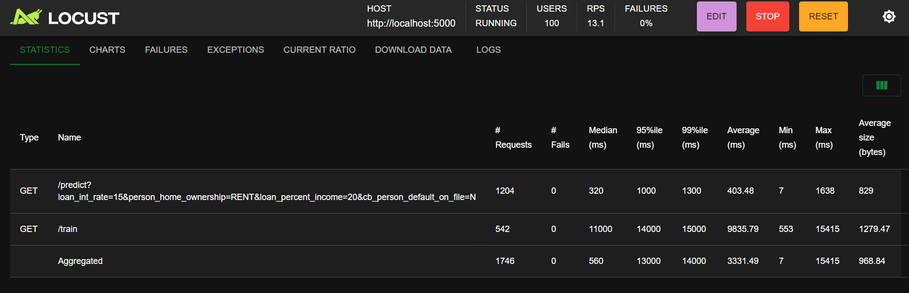
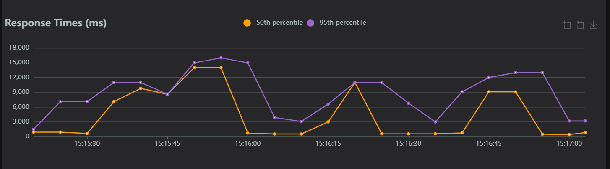

# Machine Learning Pipeline Summative

## Links
[Youtube Demo](https://youtu.be/QQiaFmF4cgc)  
[Live Demo](https://mlops-summative.onrender.com)  
[Docker Hub](https://hub.docker.com/r/akafesu/mlops-summative)

## Project Description
Usizo is a machine learning model designed to assess the creditworthiness of loan applicants. By analyzing various financial and demographic factors, the model predicts the likelihood of loan default. This enables financial institutions to make more informed lending decisions, reducing the risk of non-performing loans.

Key features of Usizo include:

- Accurate Predictions: Leveraging advanced machine learning algorithms to provide reliable predictions.
- Real-time Scoring: Quick assessment of loan applications to streamline the approval process.
- Enhanced Risk Management: Identifying high-risk borrowers to mitigate potential losses.
- Improved Loan Book Valuation: Assisting banks in accurately valuing their loan portfolios.
- Forecasting Future Cash Flows: Providing insights into future revenue streams and potential defaults.

By empowering financial institutions with data-driven insights, Usizo contributes to a more stable and resilient financial landscape.

## How to setup

Setting Up a Local Instance of the Usizo Model

### Prerequisites:
- Docker: Ensure Docker Desktop or a similar Docker environment is installed and running on your machine.

### Steps:
1. Pull the Pre-built Image:

Use the following command to pull the pre-built image from Docker Hub:

`docker pull akafesu/mlops-summative`

2. Run the Docker Container:

Start the container, exposing port 8080 of the container to port 8080 on your host machine:

`docker run -it -p 8080:8080 akafesu/mlops-summative`

3. Accessing the Model:
Same as before, you can access the model's API endpoint at http://localhost:8080/predict.
Send a GET request with the necessary input features in JSON format.
The model will process the input and return a prediction, indicating the whether a person will default or not.

4. Use the Web UI:
Alternatively, use the Web UI by going to http//localhost:8080

## Locust Flood Simulation Results

